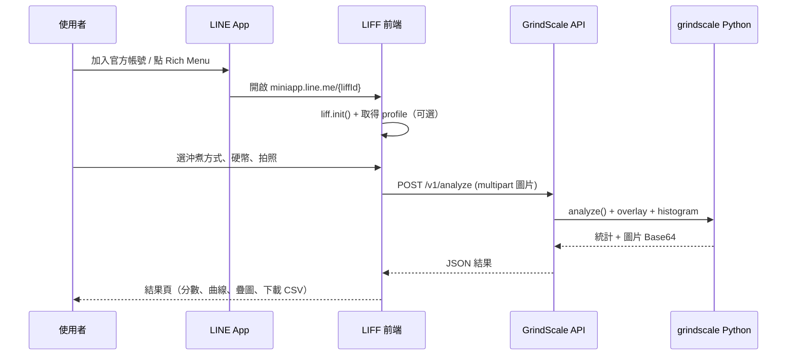
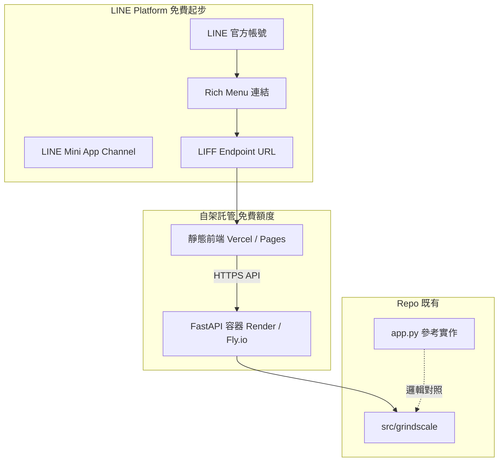

# GrindScale LINE Mini App（LIFF）設計書

> **方案**：在 LINE 內開啟網頁（LIFF / LINE Mini App），後端共用 `src/grindscale` Python 分析核心。  
> **目標市場**：台灣官方帳號免費方案起步，使用者自行開啟 Mini App，盡量不消耗每月推播訊息額度。  
> **狀態**：設計稿 v0.1（2026-05-29）

---

## 1. 產品目標與範圍

### 1.1 要做什麼

| 項目 | MVP 包含 | MVP 不包含 |
|------|----------|------------|
| 沖煮方式選擇 | ✅ 與 App 對齊的 4 種 + SKIP 預設 | 帳號跨裝置同步歷史 |
| 拍照／相簿上傳 | ✅ LIFF `input[type=file]` + `liff.scanCode` 不適用 | 原生 App 級即時預覽 ROI 手勢（Phase 2） |
| 硬幣校正 | ✅ TWD 1/5/10/50 + 不使用 | 手動 ROI 框（Phase 2，需 API 擴充） |
| 分析結果 | ✅ Score、CV、細/目/粗、D10/D50/D90、建議 | 與 iOS 100% 像素級一致（允許 Python vs Kotlin 微差） |
| 疊圖／直方圖 | ✅ Base64 PNG + 簡化曲線圖 | PDF 多頁排版（Phase 2） |
| 匯出 | ✅ CSV 下載連結；PDF 可 Phase 2 | LINE 聊天室自動推播結果（避免吃訊息額度） |
| 歷史 | ✅ 瀏覽器 `localStorage` 最近 5 筆 | 伺服器端使用者歷史（Phase 3） |
| 登入 | ✅ LIFF 自動取得 `userId`（統計用，可選） | 強制會員系統 |

### 1.2 成功指標（MVP）

- 從 Rich Menu 點開到看到結果：**P95 < 15s**（含上傳 + 分析，免費主機冷啟動除外）。
- 台灣免費官方帳號下，**不依賴推播**即可完成一次完整分析。
- 分析邏輯單一來源：`grindscale` Python 套件（與 `app.py` 相同入口）。

---

## 2. 使用者旅程



### 2.1 畫面流程（對齊 iOS 資訊架構）

| 步驟 | 畫面 ID | 說明 |
|------|---------|------|
| 0 | `splash` | Logo + 2.5s（可縮短為 1s 以省流量） |
| 1 | `home` | 選沖煮方式、展開「更多選項」、進入分析 / SKIP |
| 2 | `analysis` | 本次設定摘要、拍攝建議、硬幣選單、拍照/相簿、開始分析 |
| 3 | `loading` | 全螢幕遮罩 + 進度條（前端時間模擬 0→92→99%，與 App 相同） |
| 4 | `result` | 統計格、建議、直方圖、顆粒列表（可折疊）、疊圖、匯出 |

**導航**：單頁應用（SPA），路由 `#/home` `#/analysis` `#/result`，避免 LIFF 內多頁重新載入。

---

## 3. 系統架構



### 3.1 元件職責

| 元件 | 技術 | 職責 |
|------|------|------|
| `web/liff/` | Vite + TypeScript + Vanilla CSS 或 Preact | LIFF SDK、UI、呼叫 API、localStorage 歷史 |
| `api/` | FastAPI + uvicorn | 上傳驗證、呼叫 `grindscale`、回 JSON |
| `src/grindscale` | 既有 | 分析、校正、建議、疊圖 |
| LINE Console | — | Channel、LIFF ID、Endpoint、Rich Menu |

### 3.2 建議目錄結構（實作階段建立）

```text
GrindScale/
  docs/line-mini-app/
    DESIGN.md          # 本文件
    API.md             # Phase 1 完成後補 OpenAPI 摘要
  api/
    main.py
    routes/analyze.py
    schemas.py
    auth/liff.py       # ID Token 驗證（可選）
    Dockerfile
  web/liff/
    index.html
    src/
      liff.ts
      pages/
      theme/coffee.css
    vite.config.ts
  deploy/
    render.yaml        # 或 fly.toml 範例
```

---

## 4. LINE 平台設定（台灣・免費起步）

### 4.1 必要資源

1. [LINE Developers](https://developers.line.biz/) 提供者帳號  
2. **LINE 官方帳號**（台灣），訂閱方案：**免費**（訊息額度以 [台灣 OA FAQ](https://tw.linebiz.com/faq/oa-price/) 為準）  
3. **LINE Mini App channel**（新建 LIFF 建議走 Mini App，見 [Console 指南](https://developers.line.biz/en/docs/line-mini-app/discover/console-guide/)）  
4. Endpoint URL：`https://<your-domain>/`（必須 HTTPS）

### 4.2 訊息額度策略（省免費額度）

| 行為 | 是否計入 OA 每月訊息 |
|------|----------------------|
| 使用者點 Rich Menu 開 LIFF | 否 |
| 在 LIFF 內完成分析、看結果 | 否 |
| 主動 Push「分析完成通知」到聊天室 | **是**（MVP 不做） |
| 使用者按「分享結果到 LINE」用 `liff.shareTargetPicker` | 通常不計入 OA Push 額度（使用者主動分享） |

### 4.3 Rich Menu（MVP）

- 一個按鈕：**「粒徑分析」** → 開啟 LIFF URL `https://miniapp.line.me/{liffId}`  
- 一個按鈕（可選）：**「拍攝說明」** → 同 LIFF `#/help`

### 4.4 LIFF 能力使用

| LIFF API | 用途 |
|----------|------|
| `liff.init({ liffId })` | 啟動 |
| `liff.isInClient()` | 非 LINE 開啟時顯示「請用 LINE 開啟」 |
| `liff.getProfile()` | 顯示暱稱（可選）、匿名統計 |
| `liff.closeWindow()` | 結果頁「關閉」 |
| `liff.shareTargetPicker` | Phase 2 分享疊圖連結 |

**Scope**：MVP 僅需 `profile`（若顯示暱稱）；不需 `openid` 除非後端要綁定使用者。

---

## 5. 後端 API 設計

### 5.1 基本約定

- Base URL：`https://api.<domain>/`（與靜態站可分離）  
- 版本前綴：`/v1`  
- 編碼：UTF-8；圖片 `multipart/form-data`  
- 錯誤格式：`{ "error": { "code": "...", "message": "..." } }`

### 5.2 `GET /v1/meta`

回傳前端所需靜態設定（與 App 對齊）。

```json
{
  "brewProfiles": [
    { "id": "v60", "name": "手沖咖啡", "idealRange": "約 400–900 µm" },
    { "id": "espresso", "name": "義式咖啡", "idealRange": "約 200–600 µm" },
    { "id": "moka", "name": "摩卡壺", "idealRange": "約 220–560 µm" },
    { "id": "french", "name": "法式壓濾壺", "idealRange": "約 600–1400 µm" }
  ],
  "coins": [
    { "id": "none", "name": "不使用（相對模式）", "diameterMm": null },
    { "id": "twd1", "name": "TWD 1 元", "diameterMm": 20.0 },
    { "id": "twd5", "name": "TWD 5 元", "diameterMm": 22.0 },
    { "id": "twd10", "name": "TWD 10", "diameterMm": 26.5 },
    { "id": "twd50", "name": "TWD 50 元", "diameterMm": 28.0 }
  ],
  "roastLevels": ["淺焙", "中淺焙", "中焙", "中深焙", "深焙"],
  "limits": { "maxImageBytes": 8388608, "maxDimensionPx": 4096 }
}
```

**Profile 對照層**（`api/profile_map.py`）：將 `id` 映射到 `BREW_PROFILES` 的 key（Python 目前為 `V60` / `Moka Pot` / `French Press`，需新增 `espresso` 或映射到最接近者）。

### 5.3 `POST /v1/analyze`

**Request**（`multipart/form-data`）：

| 欄位 | 型別 | 必填 | 說明 |
|------|------|------|------|
| `image` | file | ✅ | JPEG/PNG，≤ 8MB |
| `profileId` | string | ✅ | 如 `v60` |
| `coinId` | string | ✅ | 如 `twd10` 或 `none` |
| `roastLevel` | string | 否 | 僅寫入報告/metadata |
| `beanDescription` | string | 否 | 選填 |
| `grinderDescription` | string | 否 | 選填 |
| `liffAccessToken` | string | 否 | 若啟用後端驗證 LIFF 使用者 |

**Response 200**：

```json
{
  "analysisId": "uuid",
  "calibrationText": "校正模式：1 px ≈ 12.34 µm（TWD 10）",
  "recommendation": "…",
  "quality": {
    "pass": true,
    "brightness": 128.5,
    "contrast": 45.2,
    "occupancy": 0.12,
    "text": "亮度 …（品質通過）"
  },
  "stats": {
    "particleCount": 842,
    "mean": 512.3,
    "std": 98.1,
    "cv": 0.191,
    "d10": 380, "d50": 505, "d90": 680,
    "fineRatio": 0.12, "targetRatio": 0.61, "coarseRatio": 0.27,
    "bimodal": false,
    "uniformityScore": 78,
    "mode": "calibrated",
    "unitLabel": "µm"
  },
  "histogram": {
    "bins": [{ "start": 0, "end": 25, "count": 3 }],
    "meta": "顆粒總數 …"
  },
  "particleDiameters": [412.5, 398.1],
  "images": {
    "overlayPngBase64": "…",
    "overlayWidth": 1200,
    "overlayHeight": 1600
  },
  "coinCandidates": []
}
```

**錯誤碼**：

| HTTP | code | 說明 |
|------|------|------|
| 400 | `INVALID_IMAGE` | 解碼失敗 |
| 422 | `COIN_NOT_FOUND` | 選了硬幣但未偵測到（與 App 相同文案） |
| 413 | `IMAGE_TOO_LARGE` | 超過上限 |
| 503 | `ANALYSIS_TIMEOUT` | 免費主機逾時 |

**實作對照**（Python）：

```python
# 虛擬碼 — 與 app.py 一致
quality = check_capture_quality(image_bgr)
coin_px = detect_reference_coin_diameter_px(image_bgr) if coin_id != "none" else None
um_per_px = compute_um_per_px(diameter_mm, coin_px) if coin_px else None
output = analyze(image_bgr, profile, um_per_px=um_per_px)
recommendation = build_recommendation(output.stats, profile_name)
overlay_bgr = draw_particle_overlay(image_bgr, output.particles)
```

### 5.4 `POST /v1/export/csv`

**Request**：`application/json` `{ "analysisId": "uuid" }` 或重送精簡 payload。  
**Response**：`text/csv; charset=utf-8` + BOM（與 Android `ReportExportService.makeCsv` 欄位對齊）。

MVP 替代：分析回應內直接帶 `csvDownloadToken` 或前端用同一 JSON 產 CSV（減少後端狀態）。

### 5.5 健康檢查

- `GET /healthz` → `{ "ok": true }`（Render/Fly 探針用）

---

## 6. 安全與隱私

### 6.1 LIFF ID Token（建議 Phase 1.5 啟用）

1. 前端 `liff.getAccessToken()`  
2. 後端呼叫 LINE `GET /oauth2/v2.1/verify` 驗證  
3. 通過後才接受 `POST /v1/analyze`（防濫用爬蟲）

### 6.2 上傳防護

- 副檔名 + magic bytes 檢查  
- 長邊縮放至 ≤ 2048px 再分析（降 CPU）  
- Rate limit：每 `userId` 每分鐘 N 次（免費 Redis 可 Phase 2；MVP 用記憶體 + IP）

### 6.3 資料留存

| 資料 | MVP 政策 |
|------|----------|
| 上傳原圖 | **不寫入磁碟**（記憶體處理完即丟） |
| 分析結果 | 不存伺服器；前端 localStorage |
| 日誌 | 僅 `analysisId`、耗時、profileId，無圖 |

隱私權政策頁：`#/privacy`（必填於 LIFF 審核與使用者信任）。

---

## 7. 前端（LIFF）設計要點

### 7.1 技術選型

- **Vite + TypeScript**：建置快、bundle 小  
- **無重型框架**：MVP 用輕量元件即可（或 Preact 3KB）  
- **圖表**：Canvas 自繪 Catmull-Rom（與 Android `HistogramAreaChart` 相同演算法）或 Chart.js  
- **樣式**：沿用 `CoffeeColors` 色票（`#F7F0E6` 背景、`#B87A47` amber）

### 7.2 LIFF 初始化範本

```typescript
await liff.init({ liffId: import.meta.env.VITE_LIFF_ID });
if (!liff.isInClient()) {
  showOpenInLineBanner();
}
const profile = liff.isLoggedIn() ? await liff.getProfile() : null;
```

### 7.3 拍照

- 優先 `<input type="file" accept="image/*" capture="environment">`  
- 在 LINE WebView 通常可直達相機  
- 上傳前客戶端壓縮（`canvas` max 1600px，JPEG 0.85）

### 7.4 進度條（與 App 一致）

```typescript
const TARGET_SEC = 240;
// 每 250ms：linear = elapsed / TARGET_SEC
// ≤0.92 用 linear；之後緩升到 0.99；API 回傳後設 1.0
```

### 7.5 歷史（localStorage）

```typescript
interface HistoryRecord {
  id: string;
  timestamp: number;
  profileName: string;
  mode: "calibrated" | "relative";
  score: number;
  particleCount: number;
  cv: number;
}
// 最多 30 筆，與 iOS HistoryStore 相同
```

---

## 8. 部署（免費起步方案）

### 8.1 推薦組合 A（最簡）

| 服務 | 方案 | 用途 |
|------|------|------|
| **Vercel** | Hobby | `web/liff` 靜態 + Serverless Python（若分析 < 10s 且依賴能裝進 layer） |
| 限制 | | OpenCV 在 Serverless 常過大 → **不建議** Vercel 跑分析 |

### 8.2 推薦組合 B（實務可行・仍免費起步）

| 服務 | 方案 | 用途 |
|------|------|------|
| **Cloudflare Pages** | Free | LIFF 靜態前端 |
| **Render** | Free Web Service | Docker 跑 FastAPI + `opencv-python-headless` |
| 限制 | | Free 服務 15 分鐘休眠；冷啟動 30–60s，需在 UI 提示「喚醒中」 |

### 8.3 環境變數

```bash
# API
LINE_CHANNEL_ID=...
LINE_CHANNEL_SECRET=...          # 驗證 ID Token 用
CORS_ORIGINS=https://your.pages.dev,https://miniapp.line.me
MAX_UPLOAD_BYTES=8388608

# Web (Vite)
VITE_LIFF_ID=1234567890-AbCdEfGh
VITE_API_BASE=https://grindscale-api.onrender.com
```

### 8.4 Dockerfile 草案

```dockerfile
FROM python:3.12-slim
RUN apt-get update && apt-get install -y --no-install-recommends libgl1 libglib2.0-0 && rm -rf /var/lib/apt/lists/*
WORKDIR /app
COPY pyproject.toml requirements.txt ./
COPY src ./src
COPY api ./api
RUN pip install --no-cache-dir -e . opencv-python-headless fastapi uvicorn python-multipart
CMD ["uvicorn", "api.main:app", "--host", "0.0.0.0", "--port", "8000"]
```

---

## 9. Python 核心差異與對齊計畫

| 項目 | 現狀 (`src/grindscale`) | App (iOS/Android) | LINE MVP 處理 |
|------|-------------------------|-------------------|---------------|
| 沖煮 profile 名稱 | V60, Moka Pot, French Press | 手沖、義式、摩卡、法式 | **映射表** + 補 `espresso` profile |
| 硬幣 | TWD 10, USD Quarter | TWD 1/5/10/50 | 擴充 `COIN_DIAMETER_MM` |
| ROI 手動框 | 無 | 有 | Phase 2 API 加 `coinRoi` JSON |
| 報告 CSV | 無獨立服務 | 完整 | 移植 Android `ReportExportService` 邏輯到 Python |

**Sprint 0（分析前）**：在 `src/grindscale/profiles.py` 補齊台灣硬幣與 4 種沖煮 ID，避免 LIFF 與 App 語意不一致。

---

## 10. 實作階段（建議順序）

### Phase 0 — 設計凍結（本文件）✅

- [x] 架構、API、LINE 設定、免費部署策略

### Phase 1 — 後端 API（3–5 天）

- [x] `api/main.py`：`GET /v1/meta`, `POST /v1/analyze`, `GET /healthz`
- [x] `profile_map.py`：id → `BREW_PROFILES_BY_ID`
- [x] 擴充 `profiles.py` 硬幣與義式 profile
- [x] 單元測試：`tests/test_api.py`
- [x] Docker 本地 `docker compose up`

### Phase 2 — LIFF 前端（3–5 天）

- [x] Vite 專案 + LIFF SDK + hash 路由
- [x] 畫面：home / analysis / result / loading
- [x] 呼叫 API + 進度模擬 + 錯誤文案（含未偵測硬幣）
- [x] localStorage 歷史 + CSV 下載（前端產生）

### Phase 3 — LINE 整合（1–2 天）

- [x] 部署範本：`render.yaml`、`deploy/`、`docs/line-mini-app/DEPLOY.md`
- [x] LINE 後台步驟：`docs/line-mini-app/LINE-CONSOLE.md`、`rich-menu-example.json`
- [x] SPA fallback：`web/liff/public/_redirects`
- [x] 本機一鍵：`scripts/run-dev.sh`
- [ ] 建立 Mini App channel、Endpoint 指到 Pages（需你在 Console 操作）
- [ ] Rich Menu 上線（測試用 OA）
- [ ] `liff.init` 實機測試（iOS/Android LINE）

### Phase 4 — 上線與優化（持續）

- [x] 隱私權政策頁 `#/privacy`（簡版，上線前請修訂）
- [ ] 服務條款
- [ ] LIFF ID Token 後端驗證
- [ ] 冷啟動提示、分析逾時重試
- [ ] （可選）申請 Verified Mini App

---

## 11. 風險與緩解

| 風險 | 緩解 |
|------|------|
| 免費 API 休眠 | 首屏顯示「服務喚醒中」+ `GET /healthz` 預熱 |
| OpenCV Docker 過大 | slim 映像 + headless；不載入 matplotlib GUI |
| Python 與 App 結果不一致 | 共用測試圖片黃金標準；允許 ±5% CV 差異 |
| LIFF 非 LINE 開啟 | 顯示 QR 或提示用 LINE 掃描 |
| 分析濫用 | ID Token + rate limit |

---

## 12. 相關文件

- 部署：[DEPLOY.md](./DEPLOY.md)
- LINE Console：[LINE-CONSOLE.md](./LINE-CONSOLE.md)
- 既有 Web 原型：`app.py`（Streamlit）
- 產品 MVP：`MVP_DESIGN.md`
- Android/iOS UI 對照：`ios/.../AnalysisView.swift`、`android/.../AppScreens.kt`
- LINE 定價：[Messaging API pricing](https://developers.line.biz/en/docs/messaging-api/pricing/)
- LINE Mini App：[Console guide](https://developers.line.biz/en/docs/line-mini-app/discover/console-guide/)

---

## 13. 下一步（實作啟動）

1. 確認 **LIFF 正式網域**（例如 `grindscale.pages.dev` + `api.grindscale.onrender.com`）。  
2. 執行 **Phase 1**：建立 `api/` 與 profile/硬幣對齊。  
3. 並行申請 **LINE 官方帳號**（台灣）與 **Mini App channel**（審核可與開發並行）。

若同意此設計，下一個 PR 建議從 **`api/` + `profiles.py` 擴充** 開始，再搭最小 LIFF 空白頁驗證 Endpoint。
